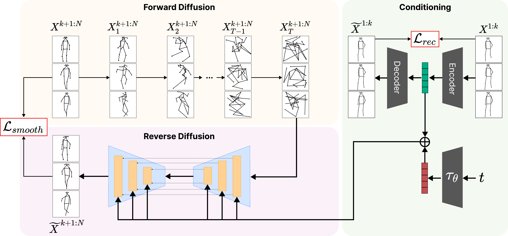

# Multimodal Motion Conditioned Diffusion Model for Skeleton-based Video Anomaly Detection
_Alessandro Flaborea*, Luca Collorone*, Guido D'Amely*, Stefano D'Arrigo*, Bardh Prenkaj, Fabio Galasso_

[](https://paperswithcode.com/sota/video-anomaly-detection-on-hr-avenue?p=multimodal-motion-conditioned-diffusion-model)
[](https://paperswithcode.com/sota/video-anomaly-detection-on-hr-shanghaitech?p=multimodal-motion-conditioned-diffusion-model)
[](https://paperswithcode.com/sota/video-anomaly-detection-on-hr-ubnormal?p=multimodal-motion-conditioned-diffusion-model)

<p align="center">
    <a href="https://pytorch.org/get-started/locally/"></a>
    <a href="https://wandb.ai/site"></a>

</p>


The official PyTorch implementation of the IEEE/CVF International Conference on Computer Vision (ICCV) '23 paper [**Multimodal Motion Conditioned Diffusion Model for Skeleton-based Video Anomaly Detection**](https://openaccess.thecvf.com/content/ICCV2023/html/Flaborea_Multimodal_Motion_Conditioned_Diffusion_Model_for_Skeleton-based_Video_Anomaly_Detection_ICCV_2023_paper.html).

<!-- Visit our [**webpage**](https://www.pinlab.org/coskad) for more details. -->


<div align="center">
<a href="https://www.youtube.com/watch?v=IuDzVez--9U">
  
</a>
</div>


## Content
```
.
├── assets
│   ├── mocodad.jpg
├── config
│   ├── Avenue
│   │   ├── mocodad_test.yaml
│   │   └── mocodad_train.yaml
│   ├── STC
│   │   ├── mocodad_test.yaml
│   │   └── mocodad_train.yaml
│   └── UBnormal
|       ├── mocodad-latent_train.yaml
│       ├── mocodad-latent_train.yaml
│       ├── mocodad_test.yaml
│       └── mocodad_train.yaml
├── environment.yaml
├── eval_MoCoDAD.py
├── models
│   ├── common
│   │   └── components.py
│   ├── gcae
│   │   └── stsgcn.py
│   ├── mocodad_latent.py
│   ├── mocodad.py
│   └── stsae
│       ├── stsae.py
│       └── stsae_unet.py
├── predict_MoCoDAD.py
├── README.md
├── train_MoCoDAD.py
└── utils
    ├── argparser.py
    ├── data.py
    ├── dataset.py
    ├── dataset_utils.py
    ├── diffusion_utils.py
    ├── ema.py
    ├── eval_utils.py
    ├── get_robust_data.py
    ├── __init__.py
    ├── model_utils.py
    ├── preprocessing.py
    └── tools.py
    
```
 

## Setup
### Environment
```sh
conda env create -f environment.yaml
conda activate mocodad
```

### Datasets
You can download the extracted poses for the datasets HR-Avenue, HR-ShanghaiTech and HR-UBnormal from the [GDRive](https://drive.google.com/drive/folders/1aUDiyi2FCc6nKTNuhMvpGG_zLZzMMc83?usp=drive_link).

Place the extracted folder in a `./data` folder and change the configs accordingly.


### **Training** 

To train MoCoDAD, you can select the different type of conditioning of the model. The default parameters achieve the best results reported in the paper 

In each config file you can choose the conditioning strategy and change the diffusion process parameters:

1. conditioning_strategy
    -  'inject': Inject condition information into the model. The indices to be used as conditioning can be set using the 'conditioning_indices' parameter. Enabled by default. 
    - 'concat': concat conditioning and noised data to be passed to the model. The indices to be used as conditioning can be set using the 'conditioning_indices' parameter.
    - 'inbetween_imp': Uses the list of indices of the 'conditioning_indices' parameter to select the indices to be used as conditioning.
    - 'random_imp': 'conditioning_indices' must be int and it is used as the number of random indices that will be selected 
    - 'no_condition': if enabled, no motion condition is passed to the model

2. Diffusion Process
    -  noise_steps: how many diffusion steps have to be performed

Update the args 'data_dir', 'test_path', 'dataset_path_to_robust' with the path where you stored the datasets.  To better track your experiments, change 'dir_name' and the wandb parameters.

To train MoCoDAD:
```sh
python train_MoCoDAD.py --config config/[Avenue/UBnormal/STC]/{config_name}.yaml
```


### Once trained, you can run the **Evaluation**

The training config is saved the associated experiment directory (`/args.exp_dir/args.dataset_choice/args.dir_name`). 
To evaluate the model on the test set, you need to change the following parameters in the config:

- split: 'Test'
- validation: 'False'
- load_ckpt: 'name_of_ckpt'

Test MoCoDAD
```sh
python eval_MoCoDAD.py --config /args.exp_dir/args.dataset_choice/args.dir_name/config.yaml
```
additional flag you can use:
- use_hr: False -> just for test. Use the entire version of the dataset or the Human-Related one.

### **Pretrained Models**

The checkpoints for the pretrained models on the three datasets can be found [HERE](https://drive.google.com/drive/folders/1KoxjwArqcIGQVBsxrlHcNJw9wtwJ7jQx?usp=drive_link).
To evaluate them follow the following steps:
1. Download the checkpoints
2. Add them to the corresponding folder `/checkpoints/[Avenue/UBnormal/STC]/pretrained_model`
3. Copy the config file /config/[Avenue/UBnormal/STC]/mocodad_test.yaml in the correct checkpoint folder
4. Update the 'load_ckpt' field with the downloaded ckpt
5. run 
    ```sh
    python eval_MoCoDAD.py --config `/checkpoints/[Avenue/UBnormal/STC]/pretrained_model/mocodad_test.yaml]
    ```

## Citation
```
@InProceedings{Flaborea_2023_ICCV,
    author    = {Flaborea, Alessandro and Collorone, Luca and di Melendugno, Guido Maria D'Amely and D'Arrigo, Stefano and Prenkaj, Bardh and Galasso, Fabio},
    title     = {Multimodal Motion Conditioned Diffusion Model for Skeleton-based Video Anomaly Detection},
    booktitle = {Proceedings of the IEEE/CVF International Conference on Computer Vision (ICCV)},
    month     = {October},
    year      = {2023},
    pages     = {10318-10329}
}
```
